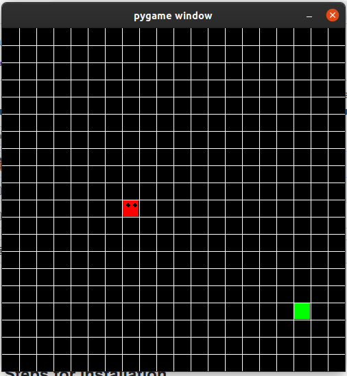

# Snake
Snake game in python using pygame

## A Glimpse


## Steps for installation
```
git clone https://github.com/kuruma99/Snake.git
cd Snake
python3 snake.py
```

## System Requirements
* python3
* pygame

## Features
* This game uses pygame framework 
* It is based on object oriented style of programming
* The code is well documented for newbies to understand

